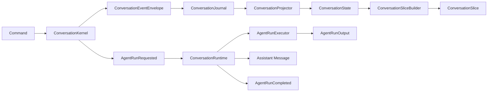

# Connor Agent Core

`connor-agent-core` is the Rust workspace for the first version of the **Conversation Kernel** in Agent OS.

The kernel is designed as an append-only, replayable, testable conversation subsystem. It records conversation changes as events, projects those events into queryable state, and builds context slices for future agent runs without directly calling an LLM, browser, plugin system, or long-term memory layer.

## Design Goals

- **Append-only event log**: every state change is represented by a `ConversationEvent`.
- **Deterministic replay**: `ConversationState` is rebuilt from events by `ConversationProjector`.
- **Separation of concerns**: the kernel manages conversations, not model inference or external tools.
- **Test-first implementation**: core behavior is covered by unit and integration tests.
- **Extensible surface**: future browser, plugin, memory, or multi-agent features can be layered on top via events and policies.

## Workspace Layout

```text
.
├── Cargo.toml
├── Cargo.lock
├── LICENSE
├── README.md
└── crates
    ├── conversation-core
    │   └── src
    │       ├── error.rs
    │       ├── event.rs
    │       ├── ids.rs
    │       ├── lib.rs
    │       ├── message.rs
    │       ├── participant.rs
    │       ├── session.rs
    │       ├── slice.rs
    │       └── visibility.rs
    ├── conversation-journal
    │   └── src
    │       ├── jsonl.rs
    │       ├── lib.rs
    │       └── memory.rs
    ├── conversation-kernel
    │   ├── src
    │   │   ├── commands.rs
    │   │   ├── kernel.rs
    │   │   ├── lib.rs
    │   │   ├── policy.rs
    │   │   ├── projector.rs
    │   │   ├── slice_builder.rs
    │   │   └── state.rs
    │   └── tests
    │       └── full_lifecycle.rs
    └── conversation-runtime
        └── src
            └── lib.rs
```

## Crates

### `conversation-core`

Domain types shared by the whole conversation subsystem.

Includes:

- ID newtypes: `ConversationId`, `EventId`, `MessageId`, `ParticipantId`, `ThreadId`
- Session model: `ConversationSession`, `ConversationKind`, `ConversationStatus`
- Participant model: `Participant`, `ParticipantKind`
- Message model: `Message`, `MessageContent`, `SuggestedAction`
- Visibility model: `Visibility`
- Event model: `ConversationEvent`, `ConversationEventEnvelope`
- Context slice model: `ConversationSlice`, `SliceBuildReason`

### `conversation-journal`

Append-only event storage abstraction.

Includes:

- `ConversationJournal` trait
- `MemoryConversationJournal` for tests and in-memory workflows
- `JsonlConversationJournal` for local durable JSONL storage

The segmented JSONL layout is:

```text
{root_dir}/{conversation_id}/
├── manifest.json
└── segments/
    ├── 00000000000000000000.jsonl
    ├── 00000000000000000001.jsonl
    └── ...
```

Each line in a segment file is one serialized `ConversationEventEnvelope`. Every envelope includes `schema_version`, currently `1`, so persisted event formats can evolve intentionally. `manifest.json` tracks the active segment and segment metadata, avoiding a single ever-growing journal file for long conversations.

### `conversation-kernel`

Command handling, projection, context slicing, and local triage policy.

Includes:

- `ConversationKernel`
- `ConversationProjector`
- `ConversationState`
- `ConversationSliceBuilder`
- `ConversationPolicy`
- `RuleBasedPolicy`

Supported commands:

- `CreateConversationCommand`
- `AppendMessageCommand`
- `CreateAssistantSuggestionCommand`
- `RequestAgentRunCommand`
- `CompleteAgentRunCommand`

### `conversation-runtime`

Runtime boundary for consuming `AgentRunRequested` events and writing agent outputs back into the conversation.

Includes:

- `AgentRunRequest`
- `AgentRunOutput`
- `AgentRunExecutor`
- `FakeAgentRunExecutor`
- `ConversationRuntime`

The runtime currently uses a fake deterministic executor for testability. Real local or remote LLMs should be added later as additional `AgentRunExecutor` implementations, not inside the kernel.

## Event-Sourced Flow



The kernel does not call a model directly. Instead, when an agent run is needed, it records boundary events such as:

- `ContextSliceBuilt`
- `AgentRunRequested`

`conversation-runtime` consumes those events through an `AgentRunExecutor`, appends an assistant output message, and records `AgentRunCompleted`.

## Quick Start

### Build

```bash
cargo build --workspace
```

### Test

```bash
cargo test --workspace
```

Current status:

```text
104 tests passed
```

### Format

```bash
cargo fmt --all
```

### Lint

```bash
cargo clippy --workspace -- -D warnings
```

## Minimal Example

```rust
use conversation_core::*;
use conversation_journal::MemoryConversationJournal;
use conversation_kernel::*;
use std::sync::Arc;

#[tokio::main]
async fn main() -> anyhow::Result<()> {
    let journal = Arc::new(MemoryConversationJournal::new());
    let kernel = ConversationKernel::new(journal);

    let user = Participant {
        id: ParticipantId::from("user-1"),
        kind: ParticipantKind::Human,
        display_name: "User".to_string(),
    };

    let agent = Participant {
        id: ParticipantId::from("agent-1"),
        kind: ParticipantKind::Agent,
        display_name: "Assistant".to_string(),
    };

    let conversation_id = kernel
        .create_conversation(CreateConversationCommand {
            kind: ConversationKind::AgentTask,
            title: Some("Design conversation kernel".to_string()),
            participants: vec![user, agent],
            actor_id: Some(ParticipantId::from("user-1")),
        })
        .await?;

    let message_id = kernel
        .append_message(AppendMessageCommand {
            conversation_id: conversation_id.clone(),
            sender_id: ParticipantId::from("user-1"),
            content: MessageContent::Text {
                text: "Help me design the event model.".to_string(),
            },
            reply_to: None,
            thread_id: None,
            visibility: Visibility::Conversation,
        })
        .await?;

    let state = kernel.load_state(&conversation_id).await?;
    let slice = ConversationSliceBuilder::new(10)
        .build_recent_window(&state, &message_id)?;

    println!("slice messages: {}", slice.messages.len());

    Ok(())
}
```

## Local Policy

`RuleBasedPolicy` is a lightweight local triage policy. It can detect messages that should request an agent run, such as:

- explicit mentions
- help requests
- summary requests
- analysis requests
- explanation requests

This policy only decides whether an agent run should be requested. It does not execute model inference.

## Testing Strategy

The project follows a layered testing approach:

1. **Core type tests**: serialization roundtrips and domain invariants.
2. **Journal tests**: append/load order, JSONL persistence, reopen behavior.
3. **Projector tests**: deterministic replay from event streams.
4. **Kernel tests**: command validation and emitted event sequences.
5. **Slice builder tests**: recent-window, thread, trigger-centered, and user-visibility filtering.
6. **Integration tests**: full lifecycle flows across kernel, journal, projector, policy, and slice builder.

## Architecture Decisions

- [ADR 0001: Defer Per-Conversation Event Sequence](./docs/adr/0001-defer-event-sequence.md)

`sequence` is intentionally not part of `ConversationEventEnvelope` yet. It will be added only after journal append ownership and concurrency semantics are specified.

## Non-Goals for v0.1

The first version intentionally does **not** implement:

- Production LLM/model inference
- Browser control
- Plugin execution
- Long-term memory writes
- Complex summarization
- Remote sync

These should be implemented as layers around the event stream, not inside the kernel itself.

## License

Apache-2.0. See [LICENSE](./LICENSE).
