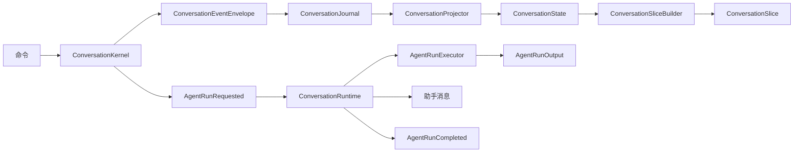

# Connor Agent Core

`connor-agent-core` 是 Agent OS 中**对话内核 (Conversation Kernel)** 第一版的 Rust 工作区。

内核设计为一个**仅追加 (append-only)、可重放 (replayable)、可测试 (testable)** 的对话子系统。它将对话状态变化记录为事件，通过投影器将事件转换为可查询的状态，并为未来的 Agent 运行构建上下文切片——整个过程不直接调用 LLM、浏览器、插件系统或长期记忆层。

## 设计目标

- **仅追加事件日志**：每个状态变化都由一个 `ConversationEvent` 表示。
- **确定性重放**：`ConversationState` 通过 `ConversationProjector` 从事件重建。
- **关注点分离**：内核管理对话，不涉及模型推理或外部工具。
- **测试优先实现**：核心行为通过单元测试和集成测试覆盖。
- **可扩展接口**：未来的浏览器、插件、记忆或多 Agent 功能可以作为事件和策略层叠加在内核之上。

## 工作区结构

```text
.
├── Cargo.toml
├── Cargo.lock
├── LICENSE
├── README.md
└── crates
    ├── conversation-core
    │   └── src
    │       ├── action_lifecycle.rs
    │       ├── agent_run.rs
    │       ├── error.rs
    │       ├── event.rs
    │       ├── ids.rs
    │       ├── lib.rs
    │       ├── message.rs
    │       ├── participant.rs
    │       ├── session.rs
    │       ├── slice.rs
    │       └── visibility.rs
    ├── conversation-journal
    │   └── src
    │       ├── jsonl.rs
    │       ├── lib.rs
    │       └── memory.rs
    ├── conversation-kernel
    │   ├── src
    │   │   ├── commands.rs
    │   │   ├── kernel.rs
    │   │   ├── lib.rs
    │   │   ├── policy.rs
    │   │   ├── projector.rs
    │   │   ├── slice_builder.rs
    │   │   └── state.rs
    │   └── tests
    │       ├── action_lifecycle.rs
    │       ├── agent_run_lifecycle.rs
    │       ├── command_validation.rs
    │       ├── full_lifecycle.rs
    │       ├── linked_entity_events.rs
    │       └── message_edit.rs
    ├── entity-core
    ├── assistant-core
    ├── model-adapter
    ├── agent-runtime
    ├── action-core
    ├── action-runtime
    ├── capability-policy
    ├── audit-log
    ├── artifact-core
    ├── surface-core
    ├── asset-core
    ├── asset-index
    └── conversation-runtime
        └── src
            └── lib.rs
```

## Crate 说明

### `conversation-core`

对话子系统共享的领域类型，包括：

- **ID 新类型**：`ConversationId`、`EventId`、`MessageId`、`ParticipantId`、`ThreadId`
- **会话模型**：`ConversationSession`、`ConversationKind`、`ConversationStatus`
- **参与者模型**：`Participant`、`ParticipantKind`
- **消息模型**：`Message`、`MessageContent`、`SuggestedAction`
- **可见性模型**：`Visibility`
- **事件模型**：`ConversationEvent`、`ConversationEventEnvelope`
- **上下文切片模型**：`ConversationSlice`、`SliceBuildReason`

### `conversation-journal`

仅追加的事件存储抽象，包括：

- `ConversationJournal` trait
- `MemoryConversationJournal`：用于测试和内存工作流
- `JsonlConversationJournal`：用于本地持久化 JSONL 存储

分段 JSONL 布局如下：

```text
{root_dir}/{conversation_id}/
├── manifest.json
└── segments/
    ├── 00000000000000000000.jsonl
    ├── 00000000000000000001.jsonl
    └── ...
```

每个分段文件中的每一行都是一个序列化的 `ConversationEventEnvelope`。每个 envelope 包含 `schema_version`（当前为 `1`），以便持久化的事件格式可以有意识地演进。`manifest.json` 跟踪活跃分段和分段元数据，避免长对话产生单个不断增长的日志文件。

### `conversation-kernel`

命令处理、投影、上下文切片和本地分诊策略，包括：

- `ConversationKernel`
- `ConversationProjector`
- `ConversationState`
- `ConversationSliceBuilder`
- `ConversationPolicy`
- `RuleBasedPolicy`

支持的命令：

- `CreateConversationCommand` — 创建对话
- `AppendMessageCommand` — 追加消息
- `CreateAssistantSuggestionCommand` — 创建助手建议
- `RequestAgentRunCommand` — 请求 Agent 运行
- `CompleteAgentRunCommand` — 完成 Agent 运行

### `agent-runtime`

当前的运行时边界，用于纯文本 Agent 运行和确定性假动作提议。它桥接对话内核与 `model-adapter`，构建上下文，调用模型适配器，可选地检测动作提议，通过 `action-runtime` 路由动作，追加助手输出，并记录 Agent 运行生命周期事件。

### `action-core`、`action-runtime`、`capability-policy` 和 `audit-log`

动作执行管道的基础 crate。对话内核记录动作生命周期事件并投影动作状态。`action-runtime` 现在协调 `ActionRequest → ActionRegistry → CapabilityPolicy → ActionExecutor → AuditLog`，处理 Allow / Ask / Deny / 失败路径。具体的 Browser / Knowledge / Mail 执行器仍属于未来工作。

### `conversation-runtime`

已废弃的运行时边界，用于消费 `AgentRunRequested` 事件并将 Agent 输出写回对话。它已被 `agent-runtime` 取代。

包括：

- `AgentRunRequest`
- `AgentRunOutput`
- `AgentRunExecutor`
- `FakeAgentRunExecutor`
- `PendingAgentRun`
- `ConversationRuntime`

运行时可以列出待处理的运行、幂等处理运行、追加助手输出并标记运行完成。当前使用假的确定性执行器以确保可测试性。真实的本地或远程 LLM 应作为额外的 `AgentRunExecutor` 实现添加，而非在内核内部实现。

### `entity-core`

实体系统核心，定义可由对话引用的实体（如文件、URL、数据对象等）的领域类型。

### `assistant-core`

助手核心，定义助手角色、能力、配置等相关领域类型。

### `model-adapter`

模型适配器抽象层，为对话内核提供统一的 LLM 调用接口。包含：

- `ModelAdapter` async trait — 统一 LLM 调用接口
- `FakeModelAdapter` — 确定性假适配器，用于测试
- `ModelRegistry` — 模型注册与解析
- `OpenAiCompatibleAdapter` — 真实 LLM 适配器，支持所有 OpenAI Chat Completions API 兼容端点（DeepSeek、Qwen、OpenAI、vLLM、Ollama 等）
- `OpenAiProviderConfig` — 支持从环境变量 `OPENAI_API_KEY`、`OPENAI_ENDPOINT`、`OPENAI_MODEL` 构建配置

### `artifact-core`

产物核心，定义对话过程中产生的结构化产物（如代码片段、图表、文件等）的领域类型。

### `surface-core`

界面核心，定义对话在不同界面上的展示方式和交互模型。

### `asset-core`

资产核心，定义可被对话引用的资产（如图片、文档、媒体等）的领域类型。

### `asset-index`

资产索引，提供资产的索引和检索能力。

## 事件溯源流程



内核不直接调用模型。当需要 Agent 运行时，内核记录边界事件，如：

- `ContextSliceBuilt`
- `AgentRunRequested`

`conversation-runtime` 通过 `AgentRunExecutor` 消费这些事件，追加助手输出消息，并记录 `AgentRunCompleted`。

## 快速开始

### 构建

```bash
cargo build --workspace
```

### 测试

```bash
cargo test --workspace
```

当前状态：

```text
519 个测试全部通过
```

### 格式化

```bash
cargo fmt --all
```

### 代码检查

```bash
cargo clippy --workspace -- -D warnings
```

## 最小示例

```rust
use conversation_core::*;
use conversation_journal::MemoryConversationJournal;
use conversation_kernel::*;
use std::sync::Arc;

#[tokio::main]
async fn main() -> anyhow::Result<()> {
    let journal = Arc::new(MemoryConversationJournal::new());
    let kernel = ConversationKernel::new(journal);

    let user = Participant {
        id: ParticipantId::from("user-1"),
        kind: ParticipantKind::Human,
        display_name: "User".to_string(),
    };

    let agent = Participant {
        id: ParticipantId::from("agent-1"),
        kind: ParticipantKind::Agent,
        display_name: "Assistant".to_string(),
    };

    let conversation_id = kernel
        .create_conversation(CreateConversationCommand {
            kind: ConversationKind::AgentTask,
            title: Some("Design conversation kernel".to_string()),
            participants: vec![user, agent],
            actor_id: Some(ParticipantId::from("user-1")),
        })
        .await?;

    let message_id = kernel
        .append_message(AppendMessageCommand {
            conversation_id: conversation_id.clone(),
            sender_id: ParticipantId::from("user-1"),
            content: MessageContent::Text {
                text: "Help me design the event model.".to_string(),
            },
            reply_to: None,
            thread_id: None,
            visibility: Visibility::Conversation,
        })
        .await?;

    let state = kernel.load_state(&conversation_id).await?;
    let slice = ConversationSliceBuilder::new(10)
        .build_recent_window(&state, &message_id)?;

    println!("slice messages: {}", slice.messages.len());

    Ok(())
}
```

## 本地策略

`RuleBasedPolicy` 是一个轻量级的本地分诊策略，可以检测应请求 Agent 运行的消息，例如：

- 明确的提及
- 帮助请求
- 摘要请求
- 分析请求
- 解释请求

此策略仅决定是否应请求 Agent 运行，不执行模型推理。

## 测试策略

项目采用分层测试方法：

1. **核心类型测试**：序列化往返和领域不变量。
2. **日志测试**：追加/加载顺序、JSONL 持久化、重新打开行为。
3. **投影器测试**：从事件流进行确定性重放。
4. **内核测试**：命令验证和发出的事件序列。
5. **切片构建器测试**：近期窗口、线程、触发器中心和用户可见性过滤。
6. **集成测试**：跨内核、日志、投影器、策略和切片构建器的完整生命周期流程。

## 架构决策

- [ADR 0001: 延迟实现每对话事件序列](./docs/adr/0001-defer-event-sequence.md)

`sequence` 当前有意不包含在 `ConversationEventEnvelope` 中。只有在日志追加所有权和并发语义被明确后才会添加。

## v0.1 非目标

第一版有意**不**实现：

- 生产级 LLM/模型推理
- 浏览器控制
- 插件执行
- 长期记忆写入
- 复杂摘要
- 远程同步

这些功能应作为事件流之上的层实现，而非内核内部。

## 许可证

Apache-2.0。详见 [LICENSE](./LICENSE)。
