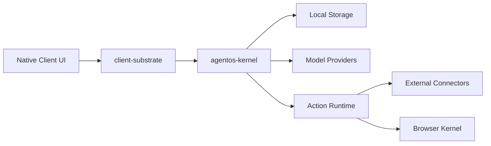

# Threat Model — Commercial Client Substrate

## Assets

- Conversation journals and projected state
- Agent run/action history
- Credentials and OAuth refresh tokens
- Audit logs and diagnostics bundles
- Knowledge entries, assets, and Work Object links
- Browser session artifacts and downloaded files

## Trust Boundaries



## Primary Risks

1. Test-only fake/memory components accidentally used in production.
2. Secrets included in diagnostics or telemetry.
3. Browser automation mutates external systems without informed approval.
4. Connector credentials outlive offboarding or revocation.
5. Local storage corruption or migration failure causes data loss.
6. Event/projection mismatch causes UI to misrepresent run/action state.
7. Model/tool loops exceed cost, privacy, or side-effect boundaries.

## Existing Controls

- Production dependency declarations and guard failures in `client-substrate`.
- Side-effect classification in `action-core`.
- Capability policy and approval flow.
- Audit log abstraction and export redaction primitives.
- Storage layout manifest, migration, repair, and backup primitives.
- Client event envelopes and projections.

## Required Host Controls

- System keychain or backend credential storage.
- Signed and notarized app artifacts.
- Crash/telemetry consent and backend retention policy.
- Enterprise offboarding and remote revocation if enterprise mode is enabled.
- Real connector smoke tests in a secret-managed CI environment.

## Verification

Run:

```bash
./scripts/security-smoke-gate.sh
./scripts/release-gate.sh
```
